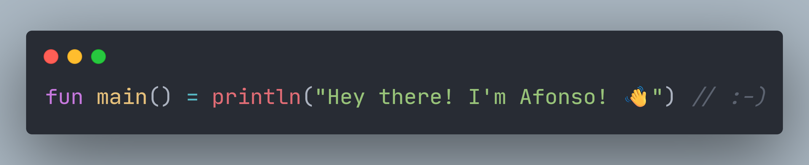

## 👨‍🔬 About Me

I'm currently pursuing my **PhD** at **Iscte - University Institute of Lisbon**, where I also serve as a Research Assistant at **ISTAR-Iscte**. 

When I'm done with my PhD, I'm aiming to become a university professor of **Introductory Programming**, **Algorithms and Data Structures**, and **Theory of Computation**. Any/all of the above! 🙂

My primary research interests are educational resource generation, educational programming tools, and automated evaluation. I'm all about **CS Education**!

- 🔭 I’m currently working on **automated generation** of **personalised questions about code**.
- ☕ I’m in too deep within the JVM domain (**Java** and **Kotlin**).
- 🎓 I maintain the automated grading tool for the Algorithms and Data Structures course of the Computer Engineering programme at ISCTE-IUL.
- 📝 My guilty pleasures are automating academic processes (e.g., generating exam sheets with solutions) and making custom-made **LaTeX** templates.
